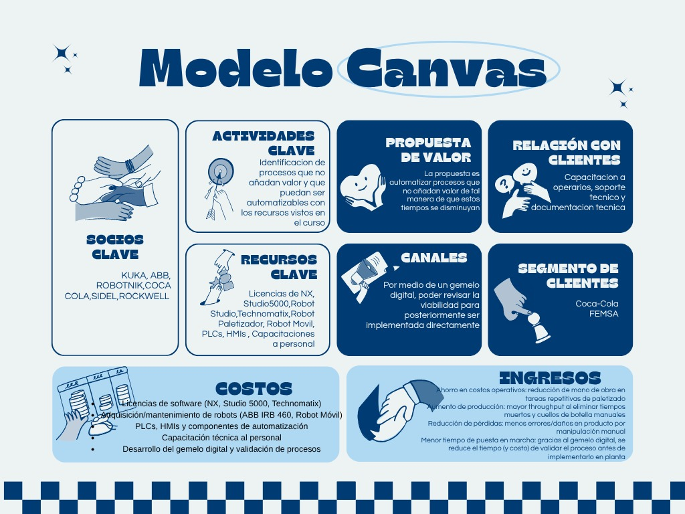

# Modelo de Negocio

Esta carpeta contiene el **Modelo de Negocio Canvas** desarrollado para el proyecto integrador. Este modelo permite representar de manera estructurada los elementos clave de la propuesta de valor, la operación y la viabilidad del proyecto, facilitando la comprensión de cómo la solución genera valor para sus usuarios y cómo se relacionan sus principales componentes.

El **Business Model Canvas** constituye una herramienta estratégica para analizar y comunicar el modelo de negocio, identificando los recursos, actividades, clientes y aspectos financieros necesarios para la implementación de la solución.

---

## 📄 Contenido de la carpeta

| Archivo             | Descripción                                       |
| ------------------- | ------------------------------------------------- |
| **canvas.jpeg** | Modelo de Negocio Canvas del proyecto integrador. |

---

## Modelo Canvas

A continuación se presenta el Modelo de Negocio Canvas desarrollado para el proyecto:

  

---

## Objetivo

El Modelo Canvas resume la estrategia del proyecto mediante la definición de sus principales elementos, incluyendo:

* Propuesta de valor.
* Segmentos de clientes.
* Canales de comunicación y distribución.
* Relación con los clientes.
* Recursos y actividades clave.
* Socios estratégicos.
* Estructura de costos.
* Fuentes de ingresos.

Este modelo sirve como una herramienta de apoyo para comprender la viabilidad técnica y estratégica del proyecto, así como para orientar futuras mejoras y oportunidades de implementación.

