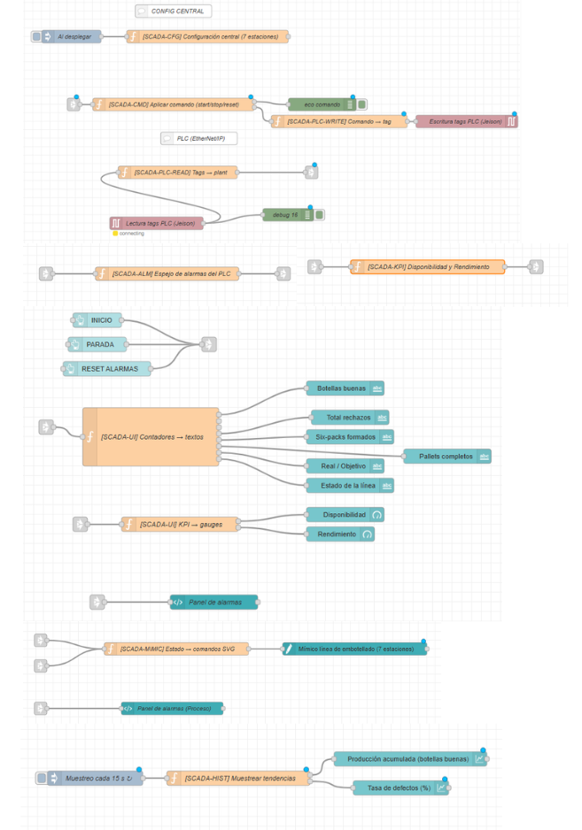
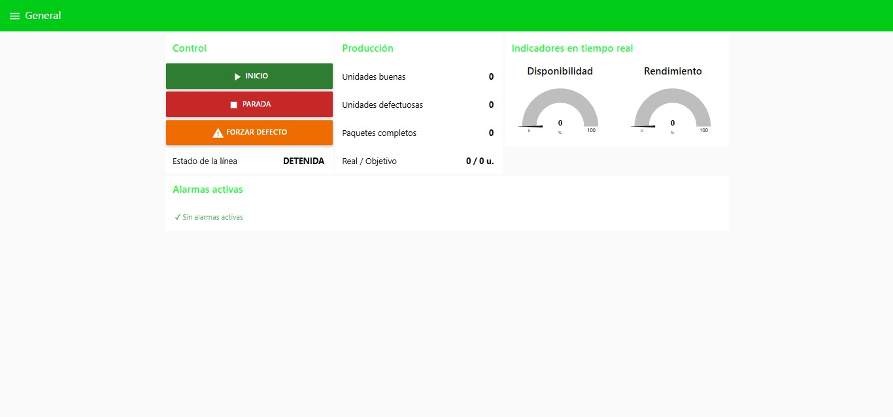
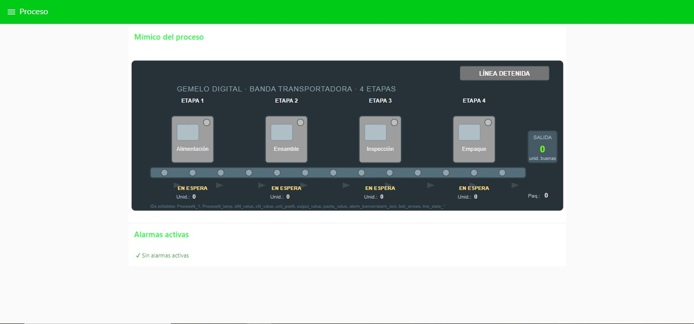
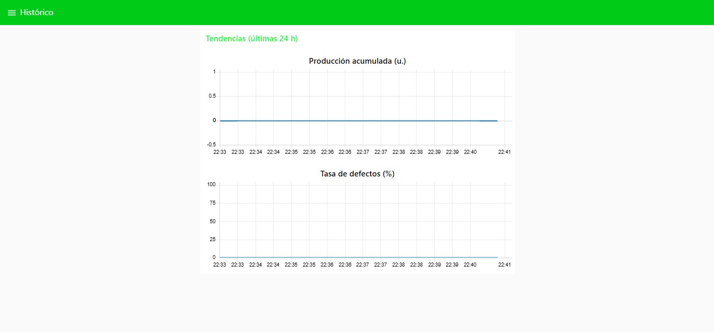

# Node-RED y Sistema SCADA

Esta carpeta contiene el desarrollo de la integración del proyecto mediante **Node-RED**, plataforma utilizada para establecer la comunicación entre los diferentes programas y componentes que conforman el sistema automatizado. A través de los flujos implementados, Node-RED actúa como un middleware que permite el intercambio de información entre el Gemelo Digital, los sistemas de simulación, el PLC y la plataforma de supervisión.

Como resultado de esta integración, se desarrolló un **SCADA (Supervisory Control and Data Acquisition)** para el monitoreo y supervisión del proceso en tiempo real, proporcionando información operativa, indicadores de desempeño y visualización del estado de la línea de producción.

---

## Contenido de la carpeta

| Archivo / Carpeta     | Descripción                                                                                     |
| --------------------- | ----------------------------------------------------------------------------------------------- |
| **Flujo Node-RED** | Flujo desarrollado para integrar la comunicación entre los diferentes componentes del proyecto. |
| **SCADA**         | Interfaces desarrolladas para la supervisión y monitoreo del proceso productivo.                |
| **flujo.json**       | Archivo JSON que representa el flujo usado en Node-Red.                          |

---

# Flujo de Integración

El siguiente flujo muestra la arquitectura implementada en **Node-RED**, encargada de gestionar el intercambio de datos entre los diferentes programas y sistemas del proyecto.

  

---

# Sistema SCADA

El sistema SCADA desarrollado permite supervisar el funcionamiento de la línea automatizada mediante tres pantallas principales, cada una enfocada en un aspecto específico de la operación.

---

## Pantalla General

Esta vista presenta un resumen del estado global del sistema, incluyendo:

* Control y conteo de producción.
* Indicadores de desempeño en tiempo real.
* Visualización de alarmas del sistema.

  

---

## Pantalla de Proceso

Esta pantalla representa el **mímico de la planta**, permitiendo visualizar el comportamiento del proceso en tiempo real.

Incluye:

* Estado de cada etapa del proceso.
* Alarmas activas.
* Conteo de unidades por estación.
* Seguimiento del flujo de producción.

  

---

## Pantalla Histórica

La vista histórica permite analizar el comportamiento del proceso mediante tendencias registradas durante las últimas **24 horas**.

Se presentan indicadores como:

* Producción acumulada.
* Tasa de defectos.
* Evolución temporal de los principales indicadores del sistema.

  

---

# Objetivo

La integración mediante **Node-RED** y el desarrollo del **SCADA** permiten centralizar la información del proyecto, facilitando la supervisión, el monitoreo y el análisis del proceso de manufactura. Esta arquitectura constituye un componente fundamental de la solución de **Industria 4.0**, al conectar los diferentes sistemas del Gemelo Digital y proporcionar información en tiempo real para apoyar la toma de decisiones y la gestión de la producción.
