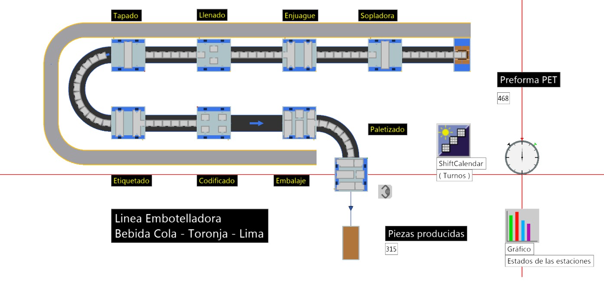
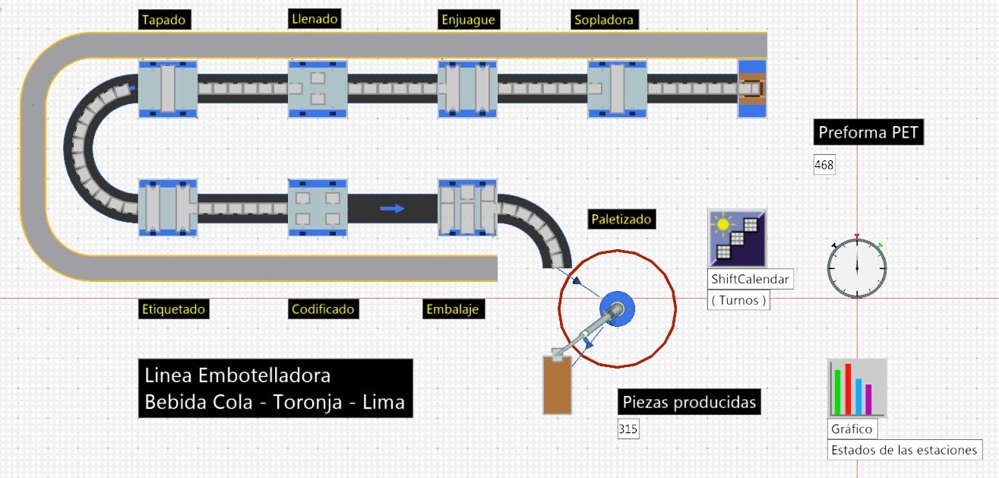
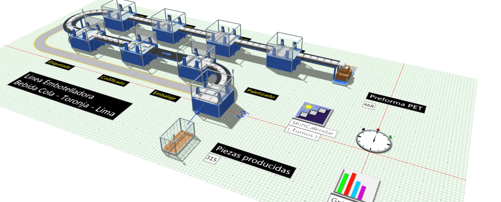

# Resultados de Plant Simulation

En esta carpeta se encuentran el modelo desarrollado en **Siemens Tecnomatix Plant Simulation** y los resultados obtenidos durante la simulación del sistema de manufactura.

## Archivo del modelo

* **PlantSimulation - APM.spp**

Este archivo contiene el modelo completo de la planta, incluyendo la configuración de los procesos, recursos y escenarios de simulación utilizados para evaluar el desempeño del sistema.

---

## Resultados de la simulación

Se realizaron dos escenarios de simulación con el fin de analizar el impacto de la incorporación de un robot en la línea de producción:

* **Escenario con robot**
* **Escenario sin robot**

### Comparación de gráficas de tiempo

|                              Sin robot                             |                             Con robot                             |
| :----------------------------------------------------------------: | :---------------------------------------------------------------: |
|  |  |

---

### Comparación de la planta en 2D

|                            Sin robot                            |                           Con robot                          |
| :-------------------------------------------------------------: | :----------------------------------------------------------: |
|  |  |

---

### Comparación de la planta en vista isométrica (3D)

|                                    Sin robot                                   |                                   Con robot                                  |
| :----------------------------------------------------------------------------: | :--------------------------------------------------------------------------: |
|  |  |

---

## Análisis

La comparación entre ambos escenarios permite evaluar el efecto de incorporar un robot al proceso productivo, analizando aspectos como:

* Tiempo de producción.
* Flujo de materiales.
* Utilización de recursos.
* Posibles cuellos de botella.
* Desempeño general del sistema.

Los resultados obtenidos sirven como base para justificar técnica y económicamente la implementación de soluciones de automatización dentro del proyecto integrador.
